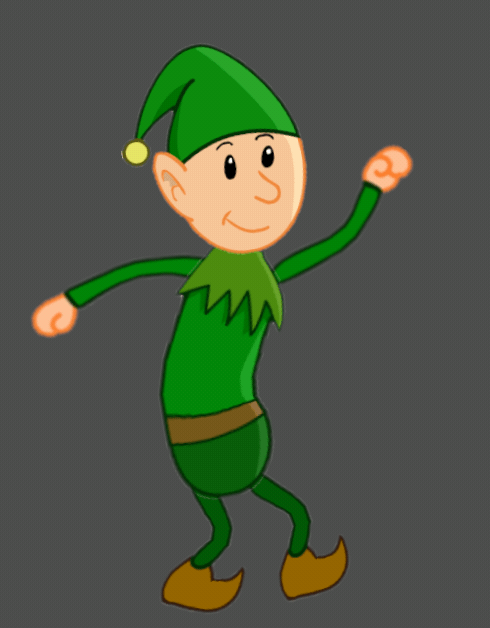
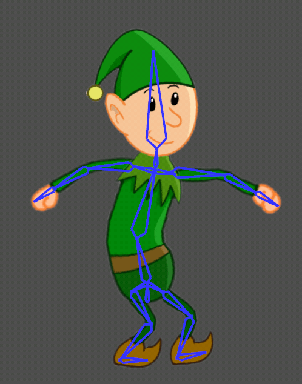

# Skeletal Animation Editor

This is a 2D skeletal animation editor was implemented with Rust and the Game Engine Bevy. A recent Bevy update added skeletal animation functionality to the game engine. This project does not use this functionality. It was put together using Bevy's parent child system and mesh rendering.

## User Manual

The editor allows the creation of a hierarchical bone structure and the generation of a 2D mesh from a simple png-file. Meshes can be bound to one or multiple bones and they will be deformed when the corresponding bones are moved, rotated or scaled. It is possible to create animations. An animation consists of keyframes. Between keyframes sufficient frames to create a fluent animation will be generated using interpolation. The nature of interpolation can be specified per keyframe by changing the easing function. The editor also supports animation layering and additive animation blending.

### Selection and Transformation

Bones as well as Sprites can be selected and transformed.

|             Input             |               Action               |
| ----------------------------- | ---------------------------------- |
| LMouse                        | Select closest entity / Confirm transformation |
| LShift + LMouse               | Add / Substract from selection     |
| LMouse + Drag                 | Select entities using rubber band  |
| G                             |      Move selected entities        |
| S                             |     Scale selected entities        |
| R                             |     Rotate selected entities       |
| Delete                        | Delete all selected entities       |


### Skeleton Creation

Use **LCtrl + LMouse** to create a new bone. The currently selected bone will automatically be assigned as parent bone.

### Skins

Inside the window labeled 'Skins' a graphics file can be selected. The listed files are stored in the folder './assets/img'. Any custom PNG-file can be added by placing it inside of that folder. The values 'cols' and 'rows' can be adjusted to define the grid that will be used to generate the skins mesh. 'add skin' will create a regular skin. 'add as cloth' will create a physics-simulated cloth. Currently it isn't possible to pin/unpin a cloth's vertices or change the cloths shape. All cloths are rectangular and the top row of vertices is pinned.

### Bind / Unbind Skin

Create a skeleton along the shape of the unbound skin. Select both skin and bones and press **A**. The selected skin is now bound to the selected bones. To unbind a skin, select it, then press **LCtrl + A**.

### Animations

Inside the window labeled 'Animations' various animation settings can be adjusted, animations can be created and edited. Under **Animations** the method of blending animations can be changed. Currently there are two settings: layering and 4-way additive blending. 'layering' simply replaces parts of the animation on lower levels, if the current layer provides values for a given bone. 4-way additive blending merges 4 animations into one using the mouse position to determine the weight of each of the 4 animations. Layers with higher numbers are above layers with lower numbers.

The following 3 GIFs show first the lower layer of an animation, then the layer above, and finally the resulting combined animation. The top layer animation only includes the right arm of the character.

|             lower layer             | top layer            | resulting combined animation |
| ----------------------------- | ---------------------------------- | ---- |
|| |  |
|| |  |

The following GIFs show an example for additive animation blending. Here four animations have been blended into one. The percentage, to which each animation influences the result, is determined by the mouse position.

|         combined animation        |       skeleton         |
| ----------------------------- | ---------------------------------- |
|| |

### Keyframe Plot

The plots serve to adjust the timing of an animation. Keyframes can be moved with LControl + LMouse. Multiple plots can be displayed simultaneously. This is solely for ease of editing and doesn't affect the animation.

|             Input             |               Action               |
| ----------------------------- | ---------------------------------- |
| Click on plot                 | Select animation / Select closest keyframe |
| LControl + LMouse + Drag      | Move a keyframe affecting the animations timing  |
| K                             | Add keyframe for applicable components |
| J                             | Replace keyframe for applicable components |
| P                             | Play / Pause animation             |

### Inverse Kinematics

It is possible to place a target for a bone. This bone and its parents, until the depth specified in the animation window, will now reach for this target using an inverse kinematics algorithm (cyclic coordinate descent). Reaching for a target has priority over the keyframe animation, so applicable bones will ignore it. Multiple targets for the same bones are not supported and will result in undefined beheaviour.

|             Input             |               Action               |
| ----------------------------- | ---------------------------------- |
| LAlt + LeftMouse              | Create a target, the selected bone will be the end effector that reaches for this target |

### Save and Load

|             Input             |               Action               |
| ----------------------------- | ---------------------------------- |
| LControl + Number             | save animation (skeleton, skin, animation layers and settings) to one of 10 save slots        |
| LAlt + Number                 | load previously saved animation |

Currently WebAssembly doesn't support saving animations. Default animations can still be loaded.

### Show/Hide Debug Shapes

Displaying bones and meshes can be toggled.

|             Input             |               Action               |
| ----------------------------- | ---------------------------------- |
| B                             | Show / Hide bones                  |
| M                             | Show / Hide mesh vertices and edges|

|             ease in out             |               ease out elastic               |
| ----------------------------- | ---------------------------------- |
|   |    |


### Controls Summary

#### Create Components
|         Input            |           Action          |
| ----------------------------- | ---------------------------------- |
| LCtrl + LMouse                | Create a bone, selected bone will automatically be assigned as parent bone    |
| LAlt + LeftMouse              | Create a target, selected bone will be the end effector that reaches for this target |
#### Select/Unselect
|         Input            |           Action          |
| ----------------------------- | ---------------------------------- |
| LMouse                        | Select closest entity |
| LShift + LMouse               | Add / Substract from selection     |
| LMouse + Drag                 | Select entities using rubber band  |
| Click on plot                 | Select animation / Select closest keyframe |
| LControl + LMouse + Drag      | Move a keyframe affecting the animations timing  |
<table>
  <tr>
    <td colspan="2" style="text-align:center"><center><b>Transforming</b></center></td>
  </tr>
  <tr>
    <td>G</td>
    <td>Move selected entities</td>
  </tr>
  <tr>
    <td>S</td>
    <td>Scale selected entities</td>
  </tr>
  <tr>
    <td>R</td>
    <td>Rotate selected entities</td>
  </tr>
  <tr>
    <td>Delete</td>
    <td>Delete selected entities</td>
  </tr>
  <tr>
    <td>K</td>
    <td>Add keyframe for applicable components</td>
  </tr>
  <tr>
    <td>J</td>
    <td>Replace keyframe for applicable component</td>
  </tr>
</table>
#### Transforming
|         Input            |           Action          |
| ----------------------------- | ---------------------------------- |
| G                             |      Move selected entities        |
| S                             |     Scale selected entities        |
| R                             |     Rotate selected entities       |
| Delete                        | Delete selected entities       |
| K                             | Add keyframe for applicable components |
| J                             | Replace keyframe for applicable components |

<table>
  <tr>
    <td colspan="2"><center><b>Other</b></center></td>
  </tr>
  <tr>
    <td>P</td>
    <td>Play / Pause animation</td>
  </tr>
  <tr>
    <td>B</td>
    <td>Show / Hide bones</td>
  </tr>
  <tr>
    <td>M</td>
    <td>Show / Hide mesh vertices and edges</td>
  </tr>
  <tr>
    <td>LMouse</td>
    <td>Confirm Transformation</td>
  </tr>
  <tr>
    <td>LControl + Number</td>
    <td>save animation (skeleton, skin, animation layers and settings) to one of 10 save slots</td>
  </tr>
  <tr>
    <td>LALT + Number</td>
    <td>load previously saved animation</td>
  </tr>
</table>
|         Input            |           Action          |
| ----------------------------- | ---------------------------------- |
| P                             | Play / Pause animation             |
| B                             | Show / Hide bones                  |
| M                             | Show / Hide mesh vertices and edges|
| LMouse                        | Confirm Transformation  |
| LControl + Number             | save animation (skeleton, skin, animation layers and settings) to one of 10 save slots        |
| LAlt + Number                 | load previously saved animation |

## Installation

### WebAssembly

Generate WASM files with:

```
cargo build --release --target wasm32-unknown-unknown
wasm-bindgen --out-dir ./out/ --target web ./target/wasm32-unknown-unknown/release/skeletal-animation-2D-editor.wasm
```